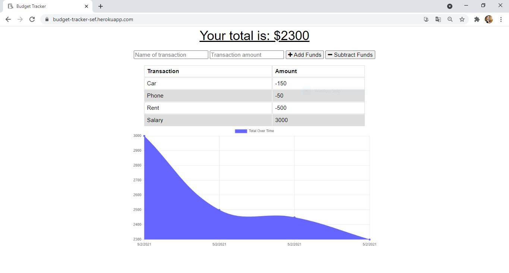
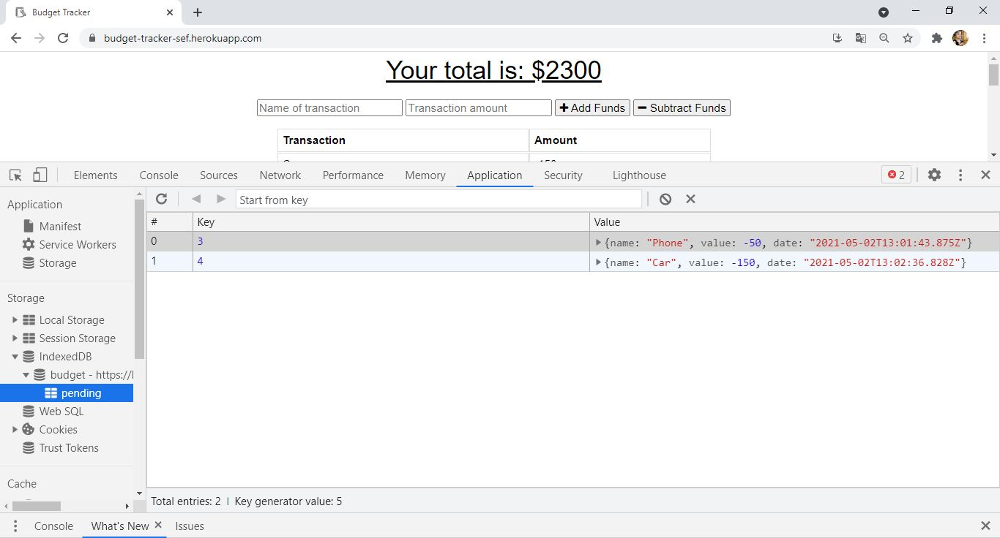

# Budget_Traker_SEF 
-----------------------------------------------------------------------------------------------------------------------
Table of content :

* [Purpose](#Purpose)
* [Method](#Method)
* [Node.js](#Nodejs)
* [JavaScript](#JavaScript) 
* [Demonstration](#Demonstration)
* [URLs](#URLs) 

-----------------------------------------------------------------------------------------------------------------------

## Purpose

The main purpose of this project is to build the offline and online functionalities of the budget tracker app. The user is able to add expenses and deposits to his budget with or without a connection. These functionalities include creating manifest file , a service worker and an indexedDb.

-----------------------------------------------------------------------------------------------------------------------

## Method

This application is created using the following languages, libraries and software.

    * Node.js
    * Javascript 
    * VS Code
    * Github
   
-----------------------------------------------------------------------------------------------------------------------

## Nodejs
    
This open-source back-end JavaScript runtime environment is used to invoke the application using the following commands :

    * npm init -y : to initialize node
    * nmp i express : to install the express package
    * nmp i mongoose : to install the mongoose package
    * nmp i morgan : to install the morgan package
    * nmp i compression : to install the compression package
    * nmp i lite-server : to install the lite-server package
    * node server.js OR npm start : to listen to the server

-----------------------------------------------------------------------------------------------------------------------

## JavaScript 

This programming language is used to create :

    * routes directory : holds all the routes to perform create, read, update, and delete operations using Mongoose models
    * models directory : holds the model 
    * public directory : holds all the static  files
    * public/db.js file : create and populate indexedDb 
    * public/service-worker.js file : create and populate service worker
    * server.js : Connects to the server and creates connection to the database
-----------------------------------------------------------------------------------------------------------------------

## Demonstration

-----------------------------------------------------------------------------------------------------------------------

## URLs

* The URL of the GitHub repository: https://github.com/SaadiaELF/Budget_Traker_SEF.git
* The URL of the deployed application : https://budget-tracker-sef.herokuapp.com/

-----------------------------------------------------------------------------------------------------------------------
